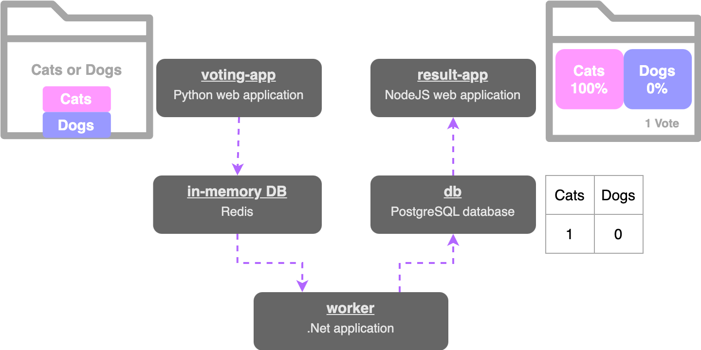

# Simple Voting App

Source code for worker, vote and result servers are taken from https://github.com/dockersamples/example-voting-app.git

---


When a user vote for either `cats` or `dogs` via the **voting-app**[`vote`], 
it is stored to the **in-memory-DB**[`redis`]. 
Then this vote is processed by the **worker**[`worker`] and it updates the persistent database [`db`]. 
The `db` has a simple table that keeps the number of votes for each category; cats & dogs. 
Finally, the result is shown in the **result-app**'s[`result`] web interface.

Server host names: 
* db
* redis
* vote
* result
* worker


## Build Images

```bash
docker build ./source-code/vote/. -t voting-app 
docker build ./source-code/worker/. -t worker
docker build ./source-code/result/. -t result-app  
```


## Bring up the network with Docker Compose

```bash
docker compose up
```

