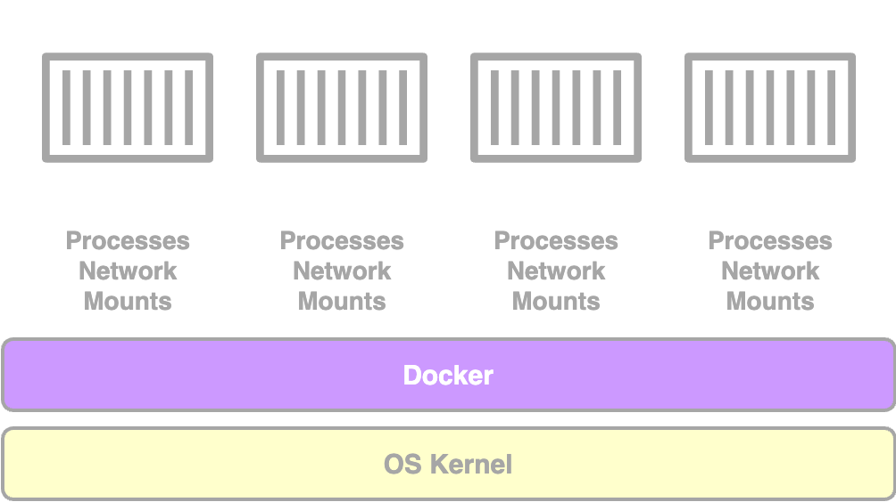

# Docker Overview

> **Docker:**&#x20;
>
> an open platform to&#x20;
>
> * build,&#x20;
> * ship, and&#x20;
> * run&#x20;
>
> distributed applications on&#x20;
>
> * laptops,&#x20;
> * data center VMs, or&#x20;
> * the cloud

## Why Docker?

<figure><figcaption>
End to end application stack - causing a matrix from hell
</figcaption></figure>

Traditional methods often struggle with:

* Compatibility between services, libraries, and OS versions
  * services and underlying OS and OS version
  * services and libraries and dependencies&#x20;
  * services and  different versions of dependent libraries
* Changes over time
  * e.g:&#x20;
    * changes to application architecture
    * version upgrades of different components
  * Compatibility between components and the underlying infrastructure must be verified whenever any of them undergoes a change.&#x20;
* Tedious environment setup for new developers
* Inconsistent application behavior across development, testing, and production environments

╰**---**➤ Difficulty in developing, building and shipping the application due to compatibility issues


Docker addresses challenges like&#x20;

* **compatibility/ dependency** issues,&#x20;
* **environment setup**, and&#x20;
* **resource efficiency**.&#x20;


\

## What is Docker?

> * **Containerize applications**
>   * Purpos&#x65;**:**&#x20;
>     * package and containerize applications
>     * ship them&#x20;
>     * run them anywhere, anytime, as many times as you want
> * Run each service with its own dependencies in separate containers,&#x20;
>   * all on the same VM and the OS
>   * but within separate environments/containers

<figure><figcaption>
With Docker
</figcaption></figure>

## Benefits of Docker

* **Flexible Component Modification:** allows to modify/change components (even the underlying operating systems) as required, without affecting  other components&#x20;
* **Simplified setup:** A single Docker configuration (build once and for all) allows developers to start with a simple `docker run` command, irrespective of the underlying operating system they run.
  * They only need to have docker installed.
* **Portability:** Applications run consistently across different environments.
* **Efficiency:** Containers are lightweight (MBs vs. GBs for VMs) and boot up quickly (seconds vs. minutes for VMs).


Containers are more lightweight and resource-efficient compared to virtual machines (VMs).


## Containers

> **Containers**:
>
> * completely isolated environments
>   * can have their own&#x20;
>     * processes/ services,&#x20;
>     * network interfaces
>     * mounts
> * like virtual machines, except they all share the same OS kernel

<figure><figcaption>
Containers
</figcaption></figure>

***


**Containers are not new with Docker**


* some of the different types of containers: `LXC`, `LXD`, `LXCFS`
  * These are very low level and setting these container environments is hard
* Docker utilizes `LXC` containers and offers a high level tool with many powerful functionalities&#x20;

***

OS[^1] consists of 2 things&#x20;

1. [**OS Kernel**](#user-content-fn-2)[^2]: responsible for interacting with the underlying hardware
2. **Set of Software**: may consists of different user interfaces, drivers, compilers, file managers, developer tools, etc.


The **OS kernel** remains same across different operating systems. It's the **software** above the kernel that differentiates them.&#x20;


e.g: a **common Linux kernel** is shared across various Linux-based OSs; custom software above it makes each OS unique

<figure><figcaption></figcaption></figure>

***


Docker containers **share the underlying OS kernel**.&#x20;


* **`Docker`**, installed on an **`Ubuntu`** system, can run containers from any Linux distribution (e.g., Debian, Fedora, SUSE, CentOS), as long as they share the same Linux kernel.
  * Here, Docker uses the **Linux kernel** of the Docker host and each Docker container only has the additional software to create unique OSes.

<figure><figcaption></figcaption></figure>

* However, Docker, installed on an Ubuntu system, cannot run Windows-based containers, as Windows uses a different kernel.
  * To run a Windows container, Docker on a Windows server is required.
* When running a Linux container with Docker installed on Windows,&#x20;
  * Docker actually runs the container on a **Linux virtual machine** under the hood, not directly on Windows.

***


Docker's **inability** **to run a different kernel on the host** operating system is **not a disadvantage**.


* **unlike** **`hypervisors`**, Docker is not meant to virtualize and run different operating systems and kernels on the same hardware.&#x20;
* Purpose of docker is to package and containerize applications so that they can be shipped and run anywhere anytime.

## Docker Containers vs. Virtual Machines

<figure><figcaption>
VM vs Docker
</figcaption></figure>

|                                                                                                                 VM                                                                                                                 |                                                                                               Docker Containers                                                                                               |
| :--------------------------------------------------------------------------------------------------------------------------------------------------------------------------------------------------------------------------------: | :-----------------------------------------------------------------------------------------------------------------------------------------------------------------------------------------------------------: |
| 
<code>Have separate OSs</code>

Overhead causes <strong>higher utilization</strong> of underlying <strong>resources</strong> <strong>-</strong> as there are multiple virtual operating systems and kernels running
 |                                                   
<code>Share the OS kernel</code>

Have better <strong>resource efficiency</strong>   
                                                  |
|                                                                                 
HVM consume higher disk space <strong>GB</strong> in size
                                                                                |                                                               
Containers are <strong>lightweight</strong> <strong>MB</strong> in size
                                                               |
|                                                                               
takes minutes to boot up  - since entire OS should be boot up
                                                                              |                                                                       
can boot up faster (in seconds) - since it's lightweight
                                                                      |
|                                                         
completely isolated can run different types of applications built on different OSs on the same hypervisor
                                                        |                                                            
less isolated more resources are shared between the containers like the kernel
                                                           |
|                                                                    
provide <strong>full OS virtualization</strong>  - host an entire operating system
                                                                    | 
Run a <strong>specific tasks or processes</strong>  e.g: 
<ul><li>host an instance of a web server/ application server/database</li><li>carry some kind of computation ro analysis task</li></ul> |

## Containers provisioned on virtual Docker hosts


**Containers and VMs can complement each other**,&#x20;

with containers deployed on virtualized hosts for scalability.


<figure><figcaption>
<strong>Containers and VMs can complement each other</strong>
</figcaption></figure>

Containers provisioned on virtual Docker hosts

* utilize the advantages of both technologies
  * benefits of **virtualization**&#x20;
    * to easily provision or decommission Docker hosts as required
  * benefits of **Docker**&#x20;
    * to easily provision applications and quickly scale them as required
  * In this case, number of VMs provisioned are lesser than usual
    * usual: VM for each application
    * in this case: VM for 100's 1000's of containers with containerized applications


Most organizations have their products containerized and available in a p**ublic Docker repository** called `DockerHub` or `Docker Store`.&#x20;


## Images and Containers

> **Images:** Templates for creating containers (e.g., preconfigured application environments).
>
> **Containers:** Running instances of images with isolated environments.

<figure><figcaption>
Images VS Containers
</figcaption></figure>


If you can't find the image you are looking for,&#x20;

\--> then you can create your own image and push it to the DockerHub repository.


&#x20;&#x20;

## DevOps Integration

* Developers and Ops teams collaborate to create a DockerFile that defines application setup.
* Images built from the `DockerFile` ensure consistent behavior across all environments.

\

[^1]: e.g: Ubuntu, Fedora, SUSE, CentOS, Debian

[^2]: e.g: Linux
