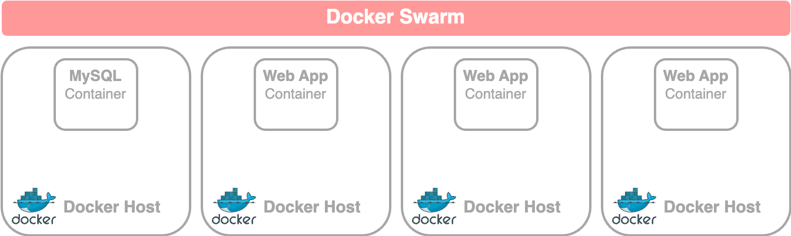
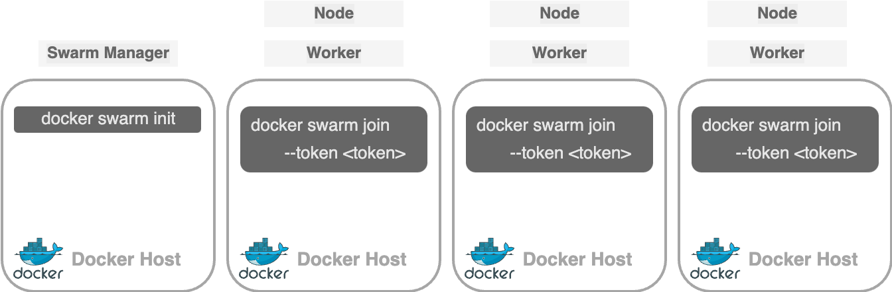

# Docker Swarm

## Docker Swarm

> **Docker Swarm:**
>
> allows you to **combine multiple Docker machines** into a single cluster.&#x20;
>
> * It manages the distribution of application instances across hosts to ensure high availability and load balancing.

<figure><figcaption></figcaption></figure>

**Swarm Orchestration simplifies orchestration** and handles several functions such as&#x20;

* load balancing
* monitoring&#x20;
* restarting failed instances automatically

## Setup Swarm

<figure><figcaption><p>Setting up Swarm</p></figcaption></figure>

To set up a Docker Swarm,&#x20;

* Install Docker on all hosts.&#x20;
* Designate one host as the **swarm manager** and others as **worker** **nodes**.&#x20;
* **Initialize the manage**r with the `docker swarm init` command, which provides a join command for the workers.&#x20;
* Run this command on the worker nodes to join them to the swarm.&#x20;
  * ```bash
    docker swarm join --token <token>
    ```
* Once joined, the workers (now **nodes**) are ready for creating and deploying services on the swarm cluster.


## Swarm Orchestration: Docker Service

To **run multiple instances of an application in a Docker Swarm cluster**, you use Docker services instead of manually running `docker run` on each node.&#x20;

> **Docker Service**:
>
> represents one or more instances of an application distributed across the cluster

### Create a Service

To create a service, use the `docker service create` command **on the manager node**

```bash
docker service create --replicas=<NUMBER_OF_INSTANCES> <IMAGE_NAME>
```


```bash
# example: run this on the manager node
docker service create --replicas=3 my-web-server
```

* This creates 3 instances of the my-web-server application distributed across worker nodes.&#x20;

Note: Manually running `docker run` on each worker node is impractical, especially with many nodes, as it requires logging into each node individually.


**The `docker service create` command resembles the `docker run` command**,&#x20;

sharing options like `-e` for environment variables, `-p` for publishing ports, and network attachment options.



