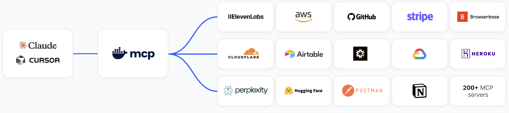

# DHI: Docker Hardened Images

## `DHI`: Docker Hardened Images

— The foundation for secure MCP, containers, and more —&#x20;

### Requirement

<figure><figcaption>
source: <a href="https://www.docker.com/">https://www.docker.com/</a>
</figcaption></figure>

* Container adoption and Common Vulnerabilities and Exposures (**`CVEs`**) are both growing exponentially
* with autonomous decisions driven by AI → stakes are higher
* with MCP →  non-deterministic tool execution adds further complexity and risk

Expecting every team to manage CVEs, rebuild images, validate fixes… across every dimension

To do

* Customization pipeline
* Compliance
* Release engineering
* Test and validation
* Security engineering
* Build and provenance
* Platform engineering
* Upstream lifecycles

<table><thead><tr><th valign="top">X times</th><th valign="top">X times</th><th valign="top">X times</th><th valign="top">X times</th></tr></thead><tbody><tr><td valign="top">
<strong>Image Types</strong>
<ul><li>Every base OS image</li><li>Every runtime (Python, Node, etc.)</li><li>Every application image</li><li>Every variant (debian, alpine, dev, prod)</li><li>Every architecture (amd64, arm64)</li></ul></td><td valign="top">
<strong>Versions &#x26; Lifecycles</strong>
<ul><li>Every major version</li><li>Every minor and patch version</li><li>Every supported upstream lifecycle</li><li>Every EOL transition</li><li>Every backported fix</li></ul></td><td valign="top">
<strong>Security events</strong>
<ul><li>Every new CVE</li><li>Every severity change</li><li>Every exploit disclosure</li><li>Every dependency vulnerability</li></ul></td><td valign="top">
<strong>Compliance &#x26; Policy</strong>
<ul><li>Every compliance standard (FIPS, STIG)</li><li>Every regulated environment</li><li>Every customer customization</li></ul></td></tr></tbody></table>

<mark style="color:$danger;">➜ This is very hard to do at scale</mark>

### Docker's Solution — `DHI`: Docker Hardened Images

<mark style="color:$success;">✅️ Docker handles all of this complexity on your behalf</mark>

* Hardened base and app images
* MCP servers
* Helm charts
* AI & ML images

Same security principles. Entirely new surface area.

* Isolation - limited blast radius
* Minimalism - reduced attack surface
* Provenance - verifiable trust
* Visible vulnerabilities - SBOMs, VEX

<figure><figcaption></figcaption></figure>

* Fully open source under Apache 2.0
* 1000+ hardened, minimal images with near-zero CVEs
* Verifiable SBOMs and SLSA Build Level 3 provenance
* Multi-distro compatibility


#### Subscriptions needed for...

1. SLA-backed images — Patch SLAs
   * Docker is responsible for patching under the SLA
   * Customizations delivered within SLA
   * Customizations preserved in upgrades & patches
   * guarantees access to fixes - even before a patch\
     is released
2. Compliant images — SOC2, FIPS, STIG ...&#x20;
3. Customizable images  — Flexible customization: certs, tools, packages...
   * SLSA Level 3 → Docker Hardened Image + Scripts/Certs
4. Extended Lifecycle Support — security that outlives upstream
   * 5 years of hardened updates
   * Updated SBOMs & provenance
   * Maintains compliance post-EOL
   * Protects long-lived workloads


