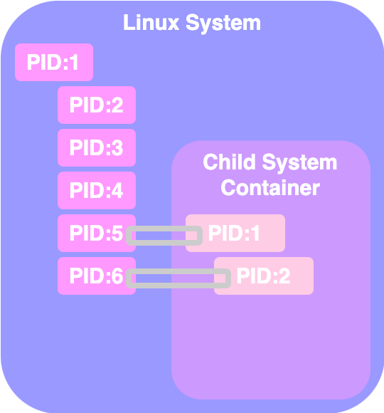

# Containerization

## Namespaces


**Docker uses namespaces to isolate workspace.**&#x20;


* Process IDs, network, interprocess communication, mounts and Unix time sharing systems are created in their own namespace, thereby providing isolation between containers.&#x20;

**Responsibilities of Docker's namespaces**

* Provide isolation between containers
* Ensure security and privacy

### Namespace Isolation Technique: Process ID Namespaces

When a Linux system boots, it starts with a single root process (`PID 1`), which spawns all other processes.&#x20;

Containers, acting like isolated systems within the host, also need their processes to start with `PID 1`. However, since **containers share the host system's kernel,** their processes are actual processes on the host with unique PIDs.

To resolve this, **process ID namespaces** are used.&#x20;

* **Each process has multiple PIDs**:&#x20;
  * one in the host's namespace and&#x20;
  * another in the container's namespace.&#x20;
* Inside the container, processes appear to originate from `PID 1`, maintaining the illusion of an independent system, while still being part of the host's process tree.

<figure><figcaption><p>PID Namespaces</p></figcaption></figure>


All processes are, in fact, **running on the same host**,&#x20;

but **separated** into their own containers **using namespaces**



## `cgroups` - Control Groups

> **`cgroups`**: **Control Groups**
>
> used to **restrict** the amount of hardware **resources** allocated to each container


By default, containers can use unlimited resources on the host system.



```bash
docker run --cpus=<MAX_CPU_PERCENTAGE> <IMAGE_MAME>
docker run --memory=<MAX_MEMORY_PERCENTAGE> <IMAGE_MAME>

# example: CPU
# ensure that the ubuntu container 
#     won't take up more than 50% of the host CPU at any given time
docker run --cpus=.5 ubuntu

# example: Memory
# limit the amount of memory that the ubuntu container can use to 100MB
docker run --memory=100m ubuntu

```

