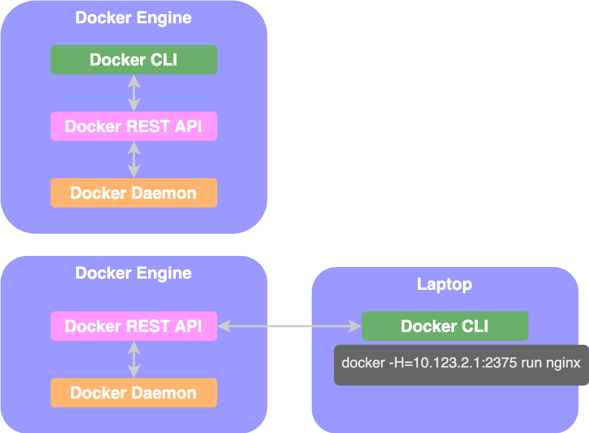

# Docker Engine

<figure><figcaption></figcaption></figure>

**`Docker Engine`**: refers to the docker host with docker installed on it

**`Docker Daemon`**: background process that manages docker objects such as images, containers, volumes and networks

**`Docker Rest API serve`**&#x72;: API interface that programs can use to talk to the daemon and provide instructions

* can be used to create your own tools

**`Docker CLI`**: command line interface used to perform actions such as running a container, stopping containers, destroying images, etc.&#x20;

* Docker CLI uses the Rest API to interact with the Docker Daemon
* Docker CLI need not necessarily be on the same host; can with a remote Docker engine

```bash
docker -H=<REMOTE_DOCKER_ENGINE_ADDRESS>:<PORT>

# example
docker -H=10.123.2.1:2375 run nginx
```

