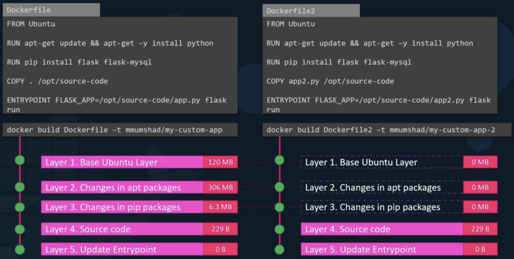
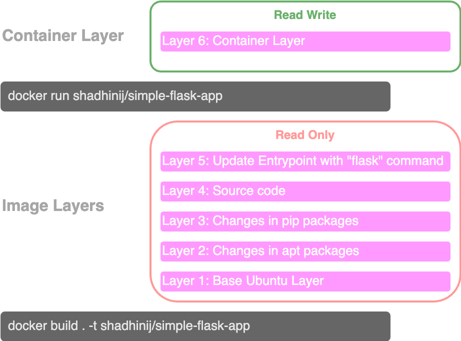
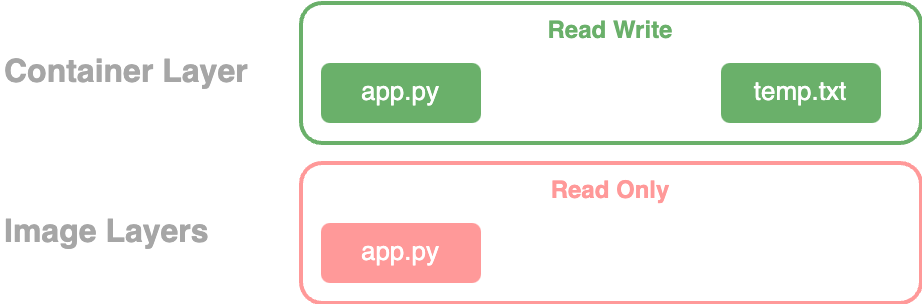

# Docker Storage Drivers and File Systems

## File System

When you install Docker on a system, it creates a folder structure at **`/var/lib/docker`**.&#x20;

�&#xDCC1;**`/var/lib/docker:`** where Docker stores all its data by default

\|---📁 aufs

\|---📁 containers

\|---📁 image

\|---📁 volumes



Docker **utlizes its** [**layered architecture**](layered-architecture.md) to store image and container files and to facilitate sharing and modifying.


If two **applications share common layers**,&#x20;

╰**--**➤ Docker reuses those layers from the cache instead of rebuilding them, saving time and disk space.


<figure><figcaption><p>Docker <strong>utlizes its layered architecture</strong> to store image and container files.</p></figcaption></figure>


<figure><figcaption><p>Docker Storage Layers</p></figcaption></figure>

**`Docker image layers:`** created during the build process and are **read-only** once finalized.&#x20;

* To modify them, a new build must be initiated.
* When a container is deleted, the underlying read-only image layers remain unchanged.
*   Docker image layers are **shared across all containers created** from the same image.


**`Container Layer`**: When a container is run from an image, Docker adds a **writable layer** on top of the image layers.&#x20;

* This writable layer stores data generated or modified by the container, such as logs or temporary files.
* The writable layer is **unique to each container** and **exists only while the container is running**.&#x20;
* When the container is **deleted**, the **writable layer** and its changes are also **destroyed**.&#x20;


## Copy-On-Write Mechanism

<figure><figcaption><p>Copy-On-Write Mechanism</p></figcaption></figure>

If you attempt to edit a file from the image layer, Docker uses a **copy-on-write mechanism**.&#x20;

* It copies the file to the writable container layer, and all modifications are made to this copy.&#x20;
* The original file in the image layer remains unchanged, ensuring the image can be shared across multiple containers without being altered.


## Volumes

A **persistent volume** can be used to persist data created by a container.

#### Create data volume

```bash
docker volume create <DATA_VOLUME_NAME>
```

<pre class="language-bash"><code class="lang-bash"># example
<strong>docker volume create data_volume
</strong></code></pre>

* This will create a folder named `data_volume` at `/var/lib/docker/volumes` directory

📁/var/lib/docker

\|---📁 volumes

&#x20;     \|---📁 data\_volume

#### Volume Mount

```bash
docker run -v <DATA_VOLUME_NAME>:<CONTAINER_PATH> <IMAGE_NAME>
```

<pre class="language-bash"><code class="lang-bash"># example
<strong>docker run -v data_volume:/var/lib/mysql mysql
</strong></code></pre>

* If you have already created the data\_volume using `docker volume create` command
  * This creates a new container and mount the data\_volume we created into `/var/lib/mysql` folder inside the container.&#x20;
* Else, (i.e. if you haven't created a volume using `docker volume create` command)
  * This will automatically create a volume named `data_volume` and mount it to  `/var/lib/mysql` folder inside the just created mysql container.&#x20;


Now, **even if the container is destroyed**, the **data** is still **available on docker host**.&#x20;



## Mounts

There are two types of mounts in Docker:

1.  **Volume Mount:** Mounts a Docker-managed volume from the default volumes directory.

    [More on Volume Mount](docker-storage-drivers-and-file-systems.md#volume-mount)


2.  **Bind Mount:** Mounts a directory from any specific location on the Docker host.

    [More on Bind Mount](../docker-run.md#volume-mapping)



Using **-v** flag for mounting is an old practice.&#x20;

✅ New practice is to use **--mount** option.


```bash
docker run --mount type=<BIND|VOLUME>,source=<HOST_PATH>,target=<CONTATINER_PATH> <IMAGE_NAME>
# example
docker run --mount type=bind,source=/data/mysql,target=/var/lib/mysql mysql
```


## Storage Drivers


Docker uses **storage drivers** to manage the **layered architecture**, create writable layers, and handle operations like copy-on-write..


Storage Drivers:

* AUFS
* ZFS
* BTRFS
* Device Mapper
* Overlay
* Overlay 2

Docker automatically selects the best storage driver based on the operating system.&#x20;

* e.g: Ubuntu uses **aufs**, while Fedora or CentOS may use **device mapper**.&#x20;

Different drivers offer varying performance and stability, so you can choose one that suits your application's needs.

