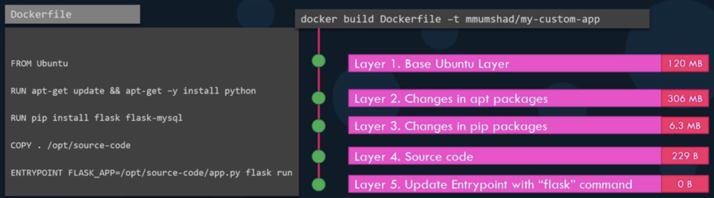

# Layered Architecture


Docker builds images in a **layered architecture**,&#x20;

where **each instruction creates a new layer** that includes only the changes from the previous layer.



Docker uses layered architecture **to facilitate sharing and modifying**.



Since **each layer** **only** **stores the changes from the previous layer**,&#x20;

&#x20;       it is reflected in the **size** as well.


<figure><figcaption><p>Layered Architecture</p></figcaption></figure>

You can view information about layered architecture of the docker image with size using the following command

```bash
docker history <IAMGE_NAME>
```



The `docker build` command shows each step and its result

&#x20;          and it **cashes all the layers**.


So the layered architecture allows you&#x20;

* to resume the build from a specific step if it fails — rebuild resumes from the failed layer
* to resume if new steps are added to the build process without starting from the beginning — only layers above the updated layer is rebuilt

╰**--**➤ **rebuilding image is faster**


