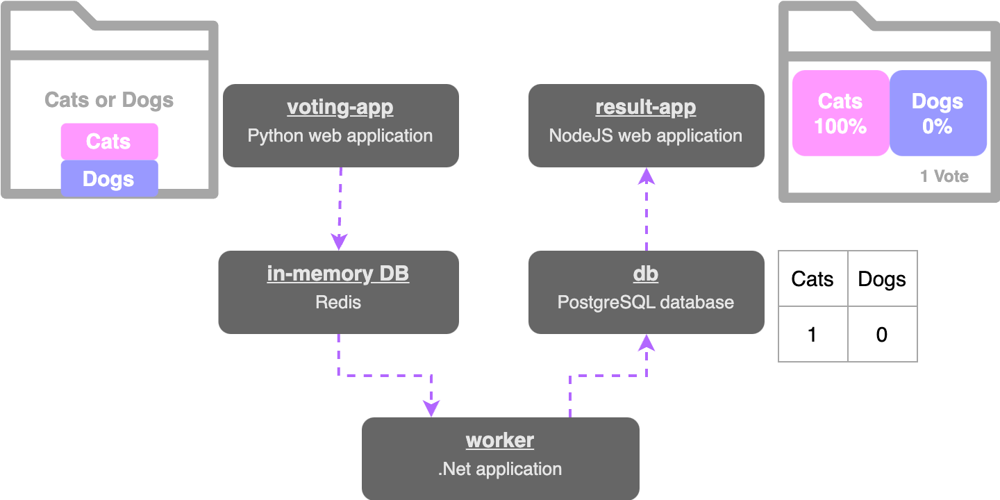
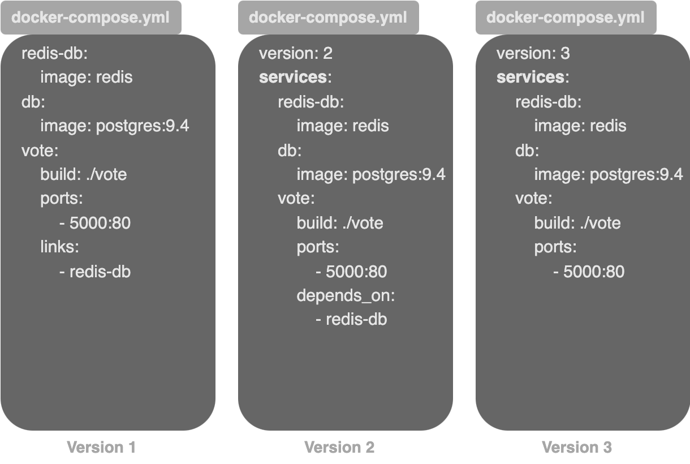
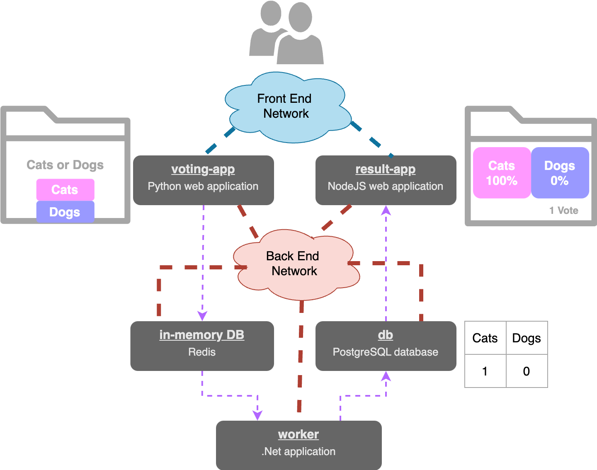

# Docker Compose

> **Docker Compose:**
>
> orchestrates the setup of multi-container applications.
>
> * allows you to **define and manage multiple services in a YAML configuration file** (`docker-compose.yml`).&#x20;
>
> Using the `docker compose up` command, you can start the entire application stack.&#x20;

It simplifies implementation, execution, and maintenance, as all changes are stored in the configuration file.&#x20;

❗However, it is **limited** to **running containers on a single Docker host**.


#### Simple Voting Application

<figure><figcaption><p>Tech stack and Data flow of a Simple Voting Application</p></figcaption></figure>

When a user vote for either `cats` or `dogs` via the **voting-app**, it is stored to the **in-memory-DB**. Then this vote is processed by the **worker** and it updates the persistent database **db**. The **db** has a simple table that keeps the number of votes for each category; cats & dogs. Finally, the result is shown in the **result-app'**&#x73; web interface.


## Linking Containers

```bash
docker run -d --link <OTHER_CONTAINER_NAME_TO_BE_LINKED>:<OTHER_CONTAINER_HOST> <IMAGE_NAME>
```

### Example Scenario

```bash
docker run -d --name=redis redis
docker run -d --name=db postgres
docker run -d --name=vote -p 5000:80 voting-app
docker run -d --name=result -p 5001:80 result-app
docker run -d --name=worker worker
```

Here, The **containers are running successfully, but they are not linked together**.&#x20;

* e.g:&#x20;
  * The voting web application hasn't been configured to use a specific Redis instance, there might be multiple instances running.&#x20;
  * The worker and result app haven't been connected to the intended PostgreSQL database.

```bash
docker run -d --name=redis redis
docker run -d --name=db postgres
docker run -d --name=vote -p 5000:80 --link redis:redis voting-app
docker run -d --name=result -p 5001:80 --link db:db result-app
docker run -d --name=worker --link db:db --link redis:redis worker 
```


You can specify a link name without using a colon and target name; it will default to **using the target name as the link name**.&#x20;

E.g:  `db:db` is equivalent to simply `db`.



Adding links this way is **deprecated**.&#x20;

Instead you can use **docker compose** or **docker swarm**.



```bash
docker run -d --name=voting-app -p 5000:80 --link redis:redis voting-app
```

* This adds an entry to the `/etc/hosts` file on the voting-app container, which contains the host name redis and the internal IP of the redis container.

```
# /etc/hosts file of voting-app
172.17.0.2      redis 3627238
```


## Linking Containers with Docker Compose

docker-compose.yml file

```docker
redis:
    image: redis

db:
    image: postgres:9.4
    
vote:
    image: voting-app
    ports: 
        - 5000:80
    links:
        - redis

result:
    image: result-app
    ports: 
        - 5001:80
    links:
        - db

worker:
    image: worker
    links:
        - redis
        - db
```


```bash
docker compose up
```

This will bring up the entire container stack. Here, we **assume** that **all images are already built**.


To instruct Docker Compose to build an image instead of pulling it, replace the `image` line with a `build` line and specify the directory containing the application code and Dockerfile.

```
redis:
    image: redis

db:
    image: postgres:9.4
    
vote:
    build: ./vote
    ports: 
        - 5000:80
    links:
        - redis

result:
    build: ./result
    ports: 
        - 5001:80
    links:
        - db

worker:
    build: ./worker
    links:
        - redis
        - db
```

Now, when `docker compose up` command is run, it will build these images to be built first and give them temporary names before linking them.



The **directory name** where you run the `docker compose up` command becomes the **project name**,&#x20;

and **all objects created** will **have** this **project name prefixed**.



## Docker Compose Versions

<figure><figcaption><p>Docker Compose Versions</p></figcaption></figure>

### Version 2


Introduced **automatic creation of a dedicated bridged network** for each project.


#### All containers under `services` tag in Version 2

All containers should be listed under `services:` tag in docker compose version 2 as Version 2 **introduces** a **separate** `networks:` **section** **to** **configure networks**.

#### Version needed in Version 2

You need to specify the **docker compose version** with `version:` tag at the beginning  of the `docker-compose.yml` file from docker compose version 2 and upwards.

#### Links not needed in Version 2

In Docker Compose Version 1, containers are attached to the default bridged network and use links for communication.&#x20;

In Version 2, Docker Compose **creates a dedicated bridged network for the application**, allowing containers to communicate using service names without needing links.&#x20;

* This network takes care of DNS resolution and all containers within the application will be able to reach each other using the service names given in the `docker-compose.yml` file.

#### Version 2 introduces `depends_on` feature

Depends\_on feature can be used to **specify a start up order** for containers.

```
version: "2"
services:
    redis:
        image: redis
    db:
        image: postgres:9.4
    vote:
        build: ./vote
        ports: 
            - 5000:80
        depends_on:
            - redis
```

* Here, docker compose will make sure to start the `redis` container before the `vote` container.

### Version 3

* Comes with support for **Swarm**.
* Introduced **`deploy`** section for defining deployment-specific options like replicas, resource limits, and rolling updates.

```
version: "3"
services:
    redis:
        image: redis
    db:
        image: postgres:9.4
    vote:
        build: ./vote
        ports: 
            - 5000:80
```


## Networks

To **separate user traffic** from internal application traffic, you can create two networks:&#x20;

1. a `front-end network` for **user traffic** and&#x20;
2. a `back-end network` for **internal traffic**

Connect user-facing apps (e.g., voting and result apps) to the front-end network and all internal components to the back-end network.

<figure><figcaption></figcaption></figure>

To do this, In the `docker-compose.yml` file,&#x20;

* create a `networks` property at the root level to define the networks to be used&#x20;
* then, under each service, add a `networks` property with a list of networks that the service should be attached to

```
version: "2"
services:
    redis:
        image: redis
        networks:
            - back-end

    db:
        image: postgres:9.4
        networks:
            - back-end
    
    vote:
        image: voting-app
        ports: 
            - 5000:80
        networks:
            - front-end
            - back-end

    result:
        image: result-app
        ports: 
            - 5001:80
        networks:
            - front-end
            - back-end

    worker:
        image: worker
        networks:
            - back-end

networks:
    front-end:
    back-end:
```


\
