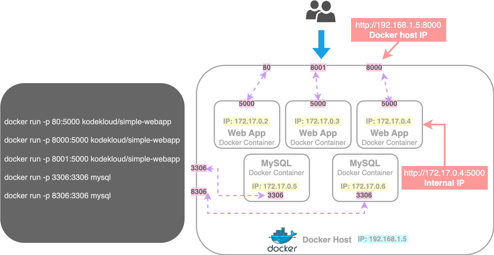
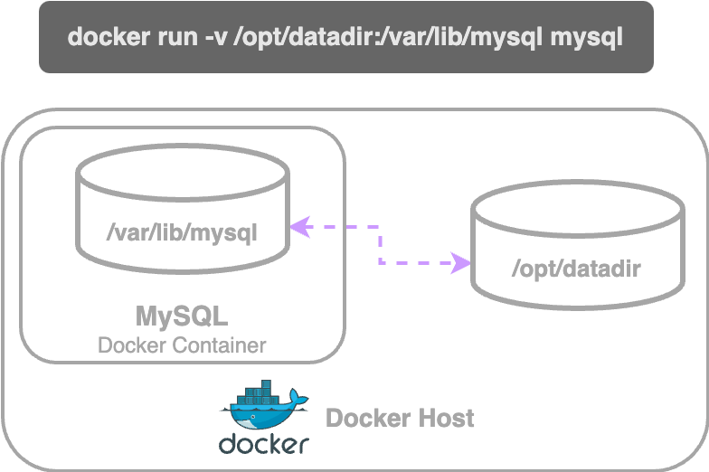

# Docker Run

## Tags

> refers to the version of an image
>
> default tag: `latest`

```bash
docker run redis
```

* This pulls the **latest** _redis_ image from the docker registry since the **default tag** is `latest` and run it.

To pull a specific version of _redis_, you need to specify that version as a `tag`.

<pre class="language-bash"><code class="lang-bash">docker run redis:<a data-footnote-ref href="#user-content-fn-1">4.0</a>
</code></pre>

* This pulls the _redis_ **version 4.0** image from the docker registry and run it.


To find information about available versions/tags of a particular image, look up the image at **`dockerhub.com`**

-> There, you will find all the supported tags in its description



## STDIN - Standard Input

> **By default**, Docker containers **do not listen to standard input** when they are running,&#x20;
>
> * even though you are attached to the console, it doesn't have a terminal to read inputs from
> * it run in non-interactive mode
>
>
>
> **If you want to provide the input,**
>
> * Then you must map the standard input of your host with **`-i`** flag
> * To include the prompt as well, you need to attach the container's terminal with **`-t`** flag

<table><thead><tr><th align="center">Examples</th></tr></thead><tbody><tr><td align="center"><pre class="language-bash"><code class="lang-bash">docker run -it ubuntu
</code></pre><p>starts an Ubuntu container in interactive mode, opening a shell inside the container for user input</p><pre class="language-bash"><code class="lang-bash">docker run -it ubuntu bash
</code></pre><p>runs an Ubuntu container and gives you a Bash shell</p><pre class="language-bash"><code class="lang-bash">docker exec -it &#x3C;CONTAINER_ID> bash
</code></pre><p>attaches to the shell of an already running container<br></p></td></tr></tbody></table>


## Port Mapping | Port Publishing

> **Port mapping | Port publishing:**&#x20;
>
> map internal container ports to the docker host ports

<figure><figcaption><p>Port Mapping</p></figcaption></figure>

```bash
# Port mapping

docker run -p <DOCKER_HOST_PORT>:<DOCKER_CONTAINER_PORT> <DOCKER_IMAGE>

# Examples

docker run -p 80:5000 kodekloud/simple-webapp

docker run -p 8000:5000 kodekloud/simple-webapp

docker run -p 8001:5000 kodekloud/simple-webapp

docker run -p 3306:3306 mysql

docker run -p 8306:3306 mysql
```


You can run **multiple instances** of your application by mapping each instance to a different port on the Docker host.&#x20;

Additionally, you can run **instances of different applications** on separate ports, allowing multiple applications or instances to coexist on the same host.



However, you **cannot map multiple containers to the same port** on the Docker host.



You **cannot modify the port mapping of an existing container.**



### Explanation: Port Mapping | Port Publishing

`Docker Host` | `Docker Engine`: the underlying host where docker is installed


Each Docker container is assigned an **`internal IP`** by default, accessible only within the Docker host.


Say, a containerized web application is running on docker and this application operates and listens on port 5000[^2].&#x20;


If you open a **browser within the docker host**,&#x20;

╰**--**➤ then you can access the application with the **Docker container's internal IP**.

But, **users outside the Docker host** cannot access the application via a web browser using the internal IP.&#x20;

╰**--**➤ Instead, they can access it using the **Docker host's IP address**.


**To enable access through the Docker host,**&#x20;

* `Port Mapping` is required.
* You must map a port from the Docker container to an available port on the Docker host.&#x20;
  * e.g: To allow users to access the application via port 80 on the Docker host, you can map port 80 on the host to port 5000 inside the container using the following command:
    * ```bash
      docker run -p <DOCKER_HOST_PORT>:<DOCKER_CONTAINER_PORT> <DOCKER_IMAGE>

      # example
      docker run -p 80:5000 <DOCKER_IMAGE>
      ```
  * This routes all traffic on port 80 of the Docker host to port 5000 inside the Docker container.


### Port Mapping on MacOS


**MacOS Networking**: On macOS, Docker uses a virtual machine to run containers, so directly accessing the container's internal IP from outside the Docker host is not possible unless you map the ports to the host machine using the `-p` option



### Ports published on host & ports exposed on container

> **Ports exposed on the container:**
>
> ports that the **container's services** (e.g., a web server, database) **listen** on inside the container.
>
>
>
> **Ports published on the host:**\
> ports mapped from the container to the host, making the container's service accessible from outside the container.


```bash
~ ➜  docker ps
CONTAINER ID   IMAGE          COMMAND                  CREATED          STATUS          PORTS                                                                                NAMES
0ba02655cbf1   nginx:alpine   "/docker-entrypoint.…"   16 seconds ago   Up 13 seconds   0.0.0.0:3456->3456/tcp, :::3456->3456/tcp, 0.0.0.0:38080->80/tcp, :::38080->80/tcp   recursing_galileo
```

`0.0.0.0:3456->3456/tcp,`&#x20;

`:::3456->3456/tcp,`&#x20;

`0.0.0.0:38080->80/tcp,`&#x20;

`:::38080->80/tcp`

* ports published on host: 3456 & 38080
* ports exposed on container: 3456 & 80


## Volume Mapping

> **Volume Mapping**: &#x20;
>
> map a directory inside the docker container to a directory outside the container on the Docker host
>
> to persist data in a docker container to an external volume
>
> * Data in a Docker container is lost when the container is removed.
> * Volumes allow data to be shared between containers.
> * Volumes can be used to store sensitive data outside of the container.
> * Mapped volumes cannot improve the speed of the Docker container.

<figure><figcaption><p>Volume Mapping</p></figcaption></figure>


Docker container has its **own isolated file system** and any changes to any files happen within the container.&#x20;



**Data** in a Docker container **can be accessed** even **after the container is stopped**.



When you **remove/delete a container**, all the **data** inside the container will be **lost**.



### Explanation: Volume Mapping

Say, you run a MYSQL container

* When databases and tables are created, the data files are stored in the location `/var/lib/mysql` inside the Docker container


**If you would like to persist data,**&#x20;

╰**--**➤  you have to map a directory outside the container on the Docker host to a directory inside the docker container as follows.

```bash
docker run -v <DOCKER_HOST_PATH>:<CONTAINER_PATH> <IMAGE_NAME>

# example
docker run -v /opt/datadir:/var/lib/mysql mysql
```

* Now, when Docker container runs, it will implicitly mount the external directory to a folder inside the Docker container
* This ensures that all your data is stored in the **external volume** at the /opt/data directory, **preserving it even if the Docker container is deleted**.


### Practical use case of Volumes


Suppose you log in to the containerized Jenkins server and make some configuration changes. If you then spin up another container and access the Jenkins server there, you won't see the configuration changes made in the first container. This happens because these are two isolated environments, and the data from the first container is not shared with the second one.

To resolve this issue, you can use **volume mapping**. By mapping the data volumes of both containers to the same directory on the Docker host, the configurations and data will be shared between them. This ensures that changes made in one container are accessible in the other.


[^1]: tag

[^2]: docker container's port
