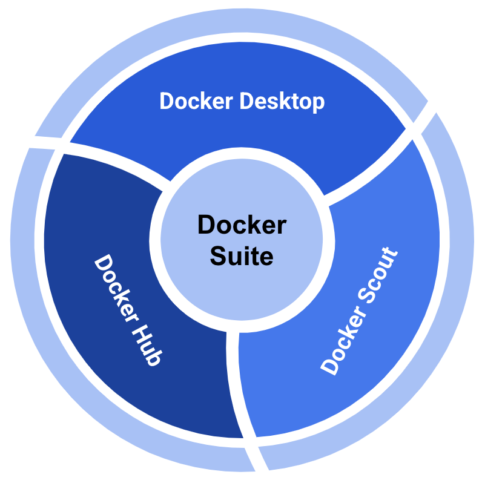

# Docker Suite

1. **Docker Hub**: container repository
2. **Docker Desktop**: access point to an entire environment to develop containers locally
3. **Docker Scout**: developer tool for managing the container supply chain

<figure><figcaption>
Docker Suite
</figcaption></figure>

## Docker Scout

> **Docker Scout:**&#x20;
>
> A developer tool that helps with analyzing and monitoring the security and compliance of container images&#x20;
>
> provides insights into vulnerabilities, outdated dependencies, and other potential issues in Docker images.

[Docker Scout](https://em.docker.com/NzkwLVNTQi0zNzUAAAGYBPDc_evsJ2JeCR5WkvDKQmYO2QmARu2ceWIzExTZWJTX_nCEHyfc69VGfmqvHbHddJA9QWY=)

#### Key Features of Docker Scout:

* **Vulnerability Scanning:** Identifies known vulnerabilities in your Docker images.
* **Dependency Analysis:** Provides information about the dependencies included in your images.
* **Compliance Monitoring:** Ensures your images comply with security and operational policies.
* **Continuous Monitoring:** Keeps track of your images over time and alerts you to new issues.
* Remediation recommendations
  * Involves recommendations for fixing bugs, improving performance, or addressing issues in software applications.&#x20;
* Policy evaluation&#x20;
* Trusted artifacts

