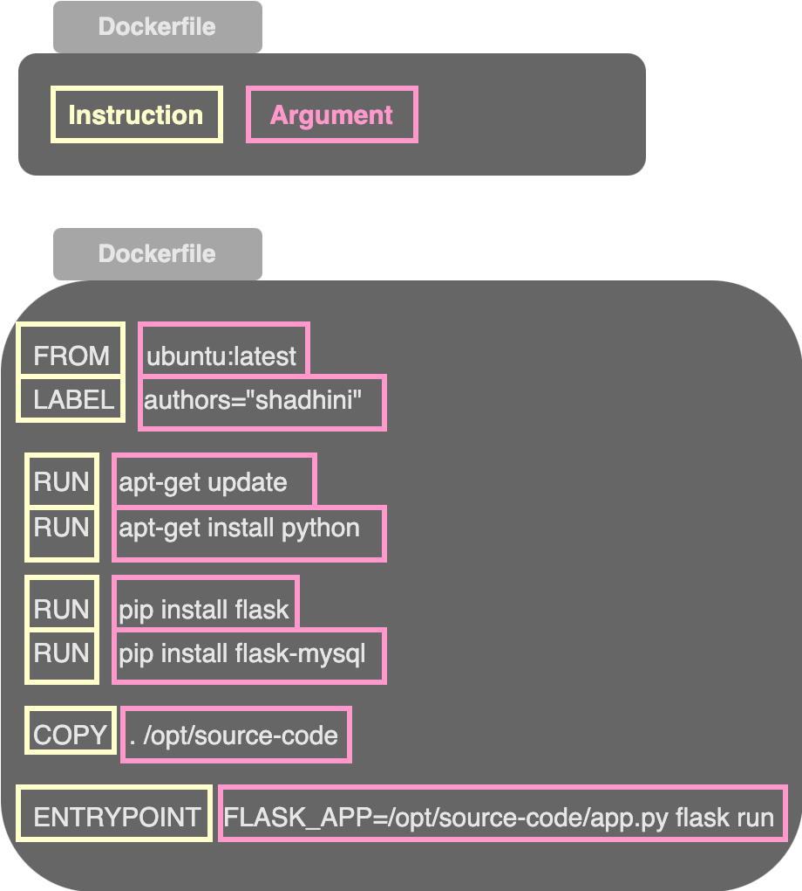
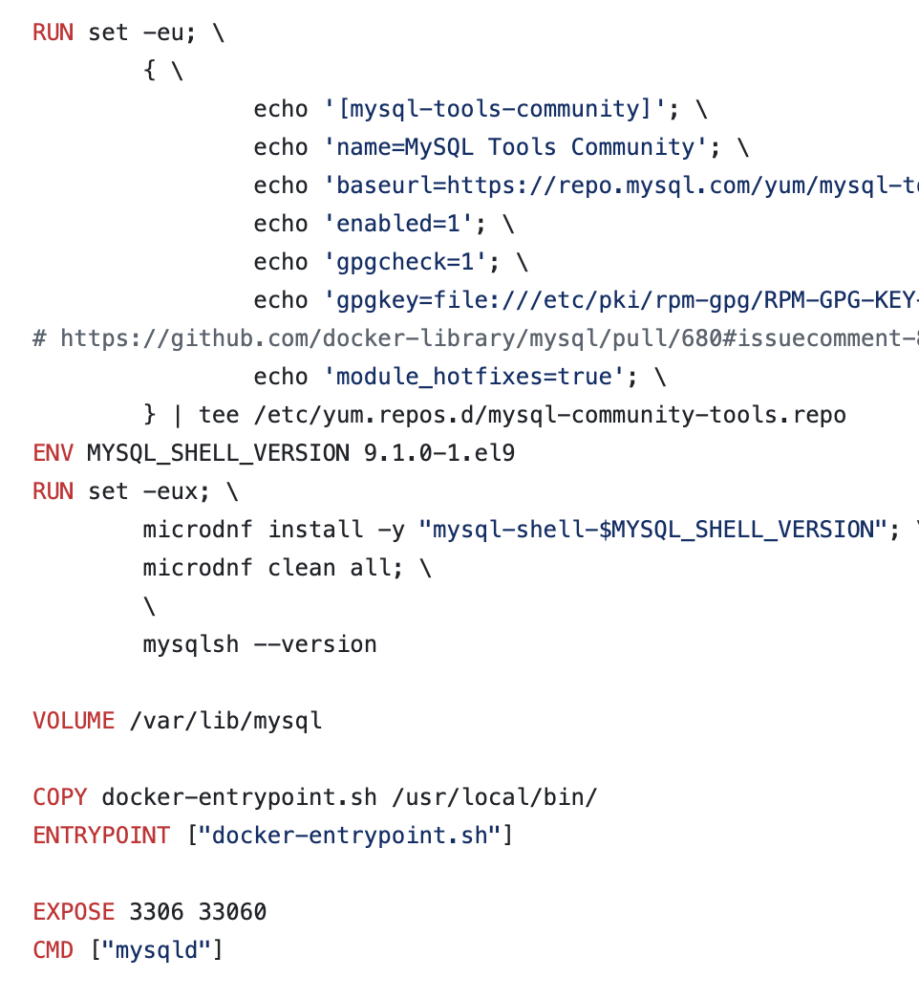
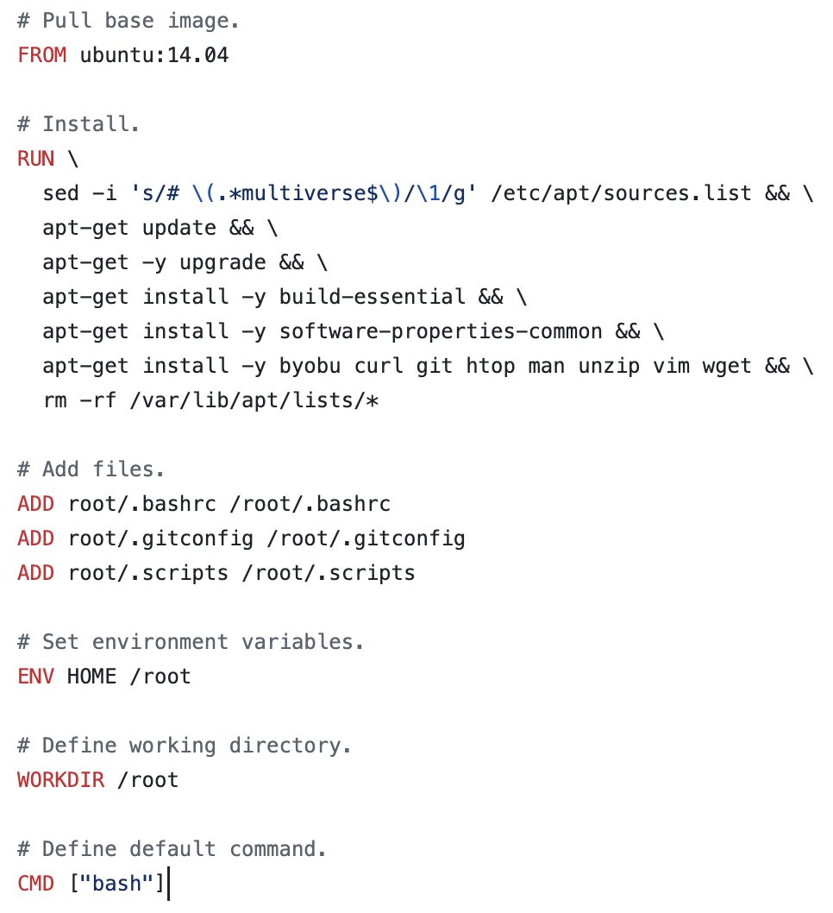
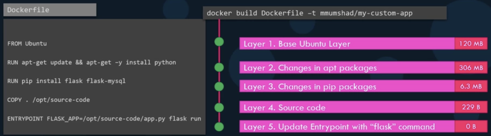

# Docker Images

> A docker image is a lightweight, standalone executable package.

## When to create your own image?

* If a component or service you need for your application is not already available on Docker Hub.
* When you/your team decided to dockerize the application you’re developing to simplify shipping and deployment.


## Create your own image

1.  Understand&#x20;

    1. what we are containerizing; what application we are creating an image for&#x20;
    2. how the application is built; what you'd do if you want to deploy the application manually


2. Write down the steps required in the right order
   *   e.g: containerize a simple web application developed using Python flask framework

       1. OS - Ubuntu
       2. Update _apt_ repo
       3. Installing dependencies using _apt_
       4. Install python dependencies using _pip_
       5. Copy source code to `/opt` folder
       6. Run the web server using the `"flask"` command


3.  Create `Dockerfile` using these steps

    * ```docker
      FROM ubuntu:latest
      LABEL authors="shadhini"

      RUN apt-get update
      RUN apt-get install python

      RUN pip install flask
      RUN pip install flask-mysql

      COPY . /opt/source-code

      ENTRYPOINT FLASK_APP=/opt/source-code/app.py flask run
      ```


4.  Build the docker image locally and tag it

    * ```bash
      docker build <PATH_TO_DOCKERFILE> -t <IMAGE_TAG/NAME>

      # example
      docker build . -t shadhinij/flask-webapp
      ```


5. Push to public `DockerHub` registry
   * ```bash
     docker push <IMAGE_NAME>

     # example
     docker push shadhinij/flask-webapp
     ```



By default, if you don't specify an organization in the image name, Docker tries to push it to the **`library`** (the default account for official repositories) and attempt would fail.&#x20;

Only Docker-supported official repositories can push to **`library`**.&#x20;

You can push images only to repositories under your own account.


## Dockerfile

<figure><figcaption><p>Dockerfile</p></figcaption></figure>


Every Docker image must be **based on either an operating system or another image** derived from an OS.



All Dockerfiles **must** start with the **FROM** instruction specifying the **base image**.


<div><figure><figcaption><p>MySQL Dockerfile</p></figcaption></figure> <figure><figcaption><p>Ubuntu Dockerfile</p></figcaption></figure></div>

> **`FROM`**: used to specify the base image
>
> **`RUN`**: instructs to run a particular command on the base image
>
> **`COPY`**: copies files from the local system on to the docker image

### `ENTRYPOINT`

> **`ENTRYPOINT`**: specifies the program/command to run when the container starts, and any **command-line arguments** we pass with the _docker run_ will be **appended** to it.&#x20;

You can pass any executable file as the ENTRYPOINT.

```docker
ENTRYPOINT <COMMAND>

# example
ENTRYPOINT ["bash"] ✅
ENTRYPOINT bash ✅
```


The **command line arguments** passed with `docker run` command will be **appended** to the ENTRYPOINT instruction.



If a command (i.e. **executable command**) is passed with `docker run` command, then it'll **replace** the ENTRYPOINT instruction.


### `CMD`

> **`CMD`**: defines the program that will be run within the container when it starts; this command is used as the default command to run when container is up if no commands are specified with the _docker run_ command.


The **command line parameters** passed will **replace** the CMD instruction **entirely**.



**Appending a command** to the **`docker run`** command **overrides the default command** specified in the Docker image with **CMD** instructions.


```bash
docker run <IMAGE_NAME> <COMMAND>

# example
docker run ubuntu sleep 1000
```

#### Specifying command simply as a in a shell form

```docker
CMD <COMMAND> <PARAM1...>

# example
CMD sleep 5
```

#### Specifying command in a JSON array format&#x20;

❗when you specify in a JSON array format, the **first element** in the array should be an **executable**

✅ The command and its parameters should be **separate elements** in the list

```docker
CMD [<COMMAND>, <PARAM1>, <PARAM2> ...]

# example
CMD ["sleep", "5"] ✅

# wrong syntax
CMD ["sleep 5"] ⛔
```


### Using `ENTRYPOINT` and `CMD` together

> In this case the **`CMD` instruction** will be **appended** **to the `ENTRYPOINT`** instruction.
>
>
>
> ❗However, for this to work **both** `ENTRYPOINT` and `CMD` instructions should be specified in **JSON format**.

This behaviour can be utilized to pass default parameters to the `ENTRYPOINT` instruction, just in case arguments are not passed with the docker run command.

```docker
ENTRYPOINT [<COMMAND>]
CMD [<PARAM1>, <PARAM2> ...] 

#example
ENTRYPOINT ["sleep"]
CMD ["10"]
```


In case, you pass arguments with the `docker run` command, then the arguments specified with the CMD instruction will be replaced by them.


## Layered Architecture


Docker builds images in a **layered architecture**,&#x20;

where **each instruction creates a new layer** that includes only the changes from the previous layer.



Since **each layer** **only** **stores the changes from the previous layer**,&#x20;

&#x20;       it is reflected in the **size** as well.


<figure><figcaption><p>Layered Architecture</p></figcaption></figure>

You can view information about layered architecture of the docker image with size using the following command

```bash
docker history <IAMGE_NAME>
```



The `docker build` command shows each step and its result

&#x20;          and it **cashes all the layers**.


So the layered architecture allows you&#x20;

* to resume the build from a specific step if it fails — rebuild resumes from the failed layer
* to resume if new steps are added to the build process without starting from the beginning — only layers above the updated layer is rebuilt

╰**--**➤ **rebuilding image is faster**



