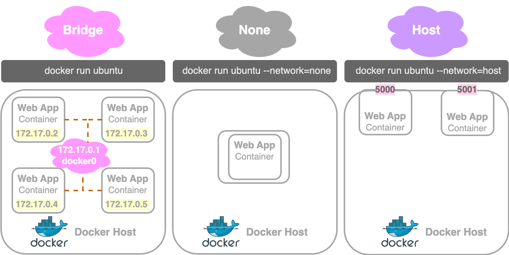
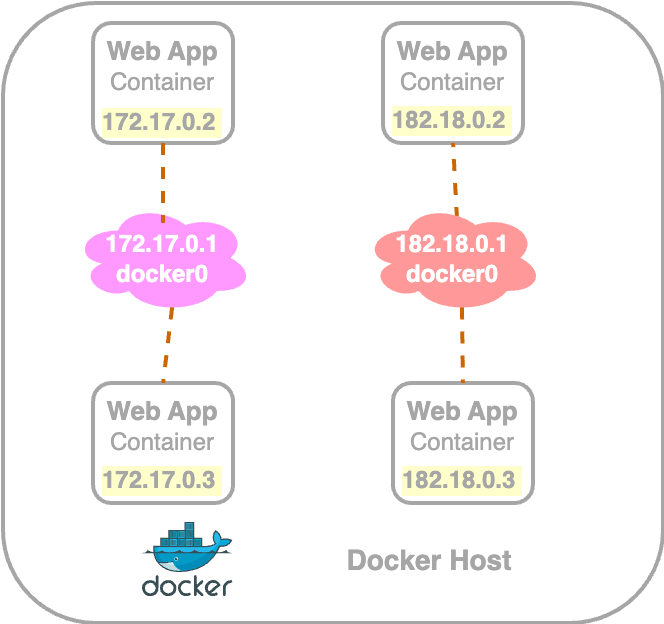

# Docker Networking

## Default Networks

When you install Docker, it creates 3 networks automatically.&#x20;

<figure><figcaption><p>Default Docker Networks</p></figcaption></figure>


1. **`Bridge`**:&#x20;
   * ```bash
     docker run ubuntu
     ```
   * the **default** network a container gets attached to
   * **private internal network** created by Docker on the host
   * docker containers in bridge network get internal IP addresses, usually in the range 172.17 series
     * containers can access each other using this internal IP
   * to access these containers from the outside, ports of these containers should be mapped to ports on the Docker host
2. **`None`**:
   * ```bash
     docker run ubuntu --network=none
     ```
   * containers are not attached to any network
   * containers don't have any access to external network or other containers and they run in an isolated network
3. **`Host`**:
   * ```bash
     docker run ubuntu --network=host
     ```
   * containers are attached to host network
   * containers can be accessed externally&#x20;
   * takes out any network isolation between the Docker host and the docker container
     * i.e: a container's services (e.g., a web server on port 5000) are directly accessible on the host's ports without mapping
   * prevents running multiple containers on the same port, as all containers share the host's network ports


## User-defined Networks

By default, Docker creates a single internal bridge network.&#x20;

To isolate containers within the Docker host, you can set up user-defined internal networks using `docker network` command.

```bash
docker network create \
    --driver <DRIVER:bridge|host|null> \
    --subnet <SUBNET_FOR_NETWORK>
    --gateway <GATEWAY> # including --gateway option is optional 
    <NETWORK_NAME>
```


### Example&#x20;

<figure><figcaption></figcaption></figure>

E.g: Create the environment above with two isolated networks:&#x20;

1. the default bridge network with a subnet in the 172.17.x.x range and&#x20;
2. a custom bridge network with a subnet in the 182.18.x.x range.

```bash
# example: create a custom internal bridge network
docker network create \
    --driver bridge \
    --subnet 182.18.0.0/16
    custom-isolated-network
```

If you want to configure gateway to 182.18.0.1, use following command,

```bash
docker network create \
    --driver bridge \
    --subnet 182.18.0.0/16
    --gateway 182.18.0.1 \
    custom-isolated-network
```


## Inspect Docker Networks

You can view all networks available with the following command.

```bash
docker network ls
```

To see the network settings and ip address assigned to an existing container, use the following command.

```bash
docker inspect <CONTAINER_ID/NAME>
```

* The `NetworkSettings:Networks` section of the returned JSON has the information about networks available.

To inspect a specific network and details such as it's subnet, use the following command

```bash
docker network inspect <NETWORK_NAME>
```


## Embedded DNS

* Using internal IP addresses to connect one container to another is not ideal, as the IP address may change after a system reboot.

**All containers in a Docker host can resolve (.i.e. reach) each other with the `name` of the container.**&#x20;

<pre class="language-python"><code class="lang-python"># e.g: connect to mysql server from a flask app
mysql.connect(<a data-footnote-ref href="#user-content-fn-1">mysql</a>) 
</code></pre>


Docker has a **`built in DNS server`** (which always runs at address `127.0.0.11`) that helps the containers to resolve each other using the container name. &#x20;



## How Docker implements networking

Docker uses&#x20;

* **`network namespaces`** to isolate containers by creating a separate namespace for each container and&#x20;
* **`virtual Ethernet pairs`** to connect containers together


[^1]: MySQL container name
